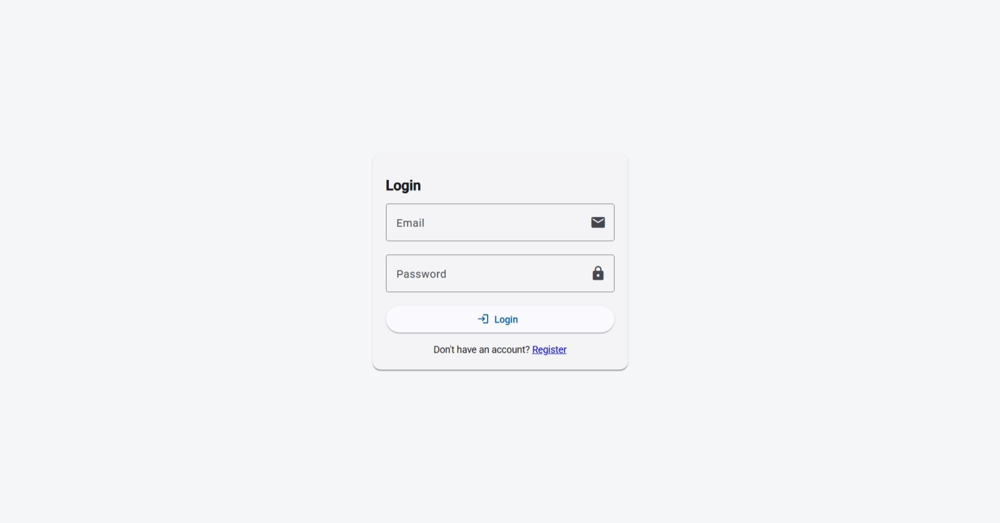
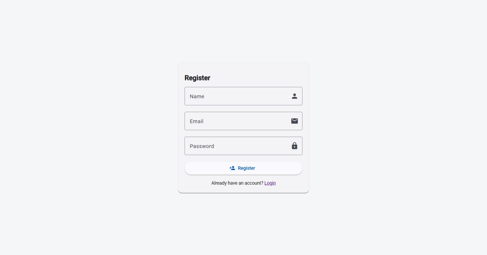
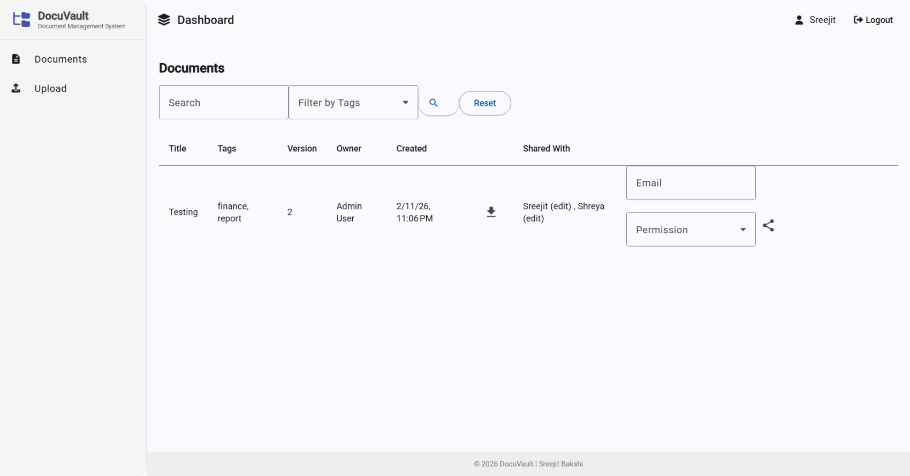
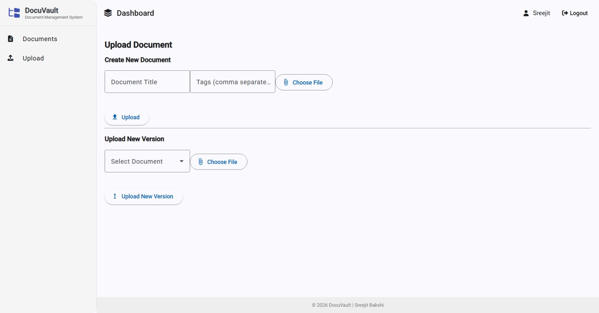
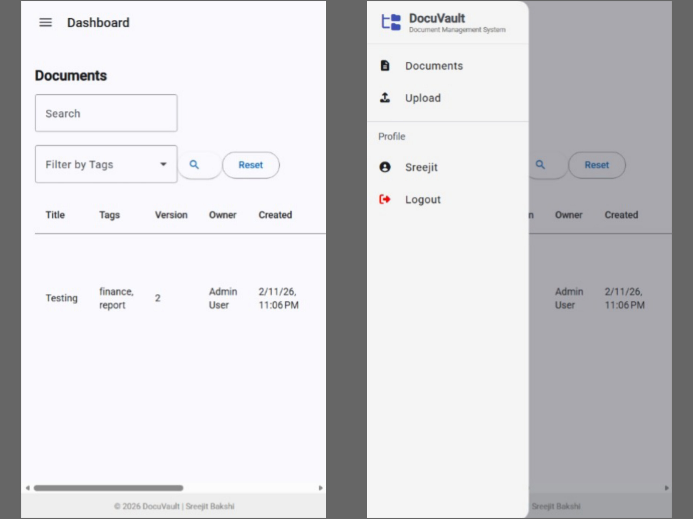
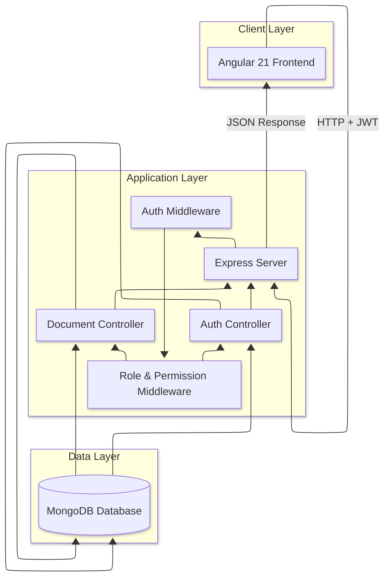

<div align="center">

# DocuVault

### Secure Document Management System


**[Live Demo](https://document-management-system-jet.vercel.app)**


*A full-stack Document Management System with authentication, access control, document versioning, and granular sharing permissions.*

</div>

---

# Table of Contents

* [Overview](#overview)
* [Approach](#approach)
* [Features](#features)
* [Demo Screenshots](#demo-screenshots)
* [Tech Stack](#tech-stack)
* [Architecture](#architecture)
* [Installation & Setup](#installation--setup)
* [Usage](#usage)
* [API Documentation](#api-documentation)
* [Project Structure](#project-structure)
* [Future Enhancements](#future-enhancements)
* [License](#license)
* [Contact](#contact)

---

# Overview

**DocuVault** is a secure and scalable Document Management System built using Angular and Node.js.

It supports:

* JWT-based authentication
* Access control
* View/Edit permission system
* Document version tracking
* Tag-based filtering
* Secure file downloads
* Responsive dashboard UI

The system enforces strict authorization rules to ensure that document access is controlled at a granular level.

---

# Approach

The system was designed with the following principles:

### 1. Separation of Concerns

* Backend handles authentication, authorization, versioning, storage
* Frontend handles state management, UI logic, and API communication

### 2. Permission-First Architecture

Each document contains:

* `owner`
* `permissions[]` with `{ user, access: view | edit }`

Access is computed dynamically for:

* Viewing
* Editing
* Sharing
* Deleting

### 3. Versioning Strategy

Each update creates a new entry in `DocumentVersion` collection:

* versionNumber
* filePath
* updatedBy
* timestamp

### 4. Responsive UI

Used Angular Material + BreakpointObserver for:

* Desktop sidebar layout
* Mobile collapsible navigation

---

# Features

## Authentication

* User registration
* Login with JWT
* Route guards
* Logout confirmation modal

## Document Management

* Upload new document
* Upload new version
* View document list
* Download document
* Delete (Owner only)

## Sharing & Permissions

* Share document by email
* Assign:

  * View permission
  * Edit permission
* Edit users can:

  * Share further
  * Upload new versions
* View users:

  * Download only
  * Cannot see sharing details
* Owner:

  * Full control

## Search & Filtering

* Partial title search
* Multi-select tag filtering (dropdown)
* Reset filters
* Empty state handling

## UX Enhancements

* Snackbar notifications
* Confirmation dialogs
* Loading spinners
* Responsive layout
* Tooltip on shared user emails
* Clean dashboard layout

---

# Demo Screenshots







---

# Tech Stack

## Frontend

* Angular (Standalone Components)
* Angular Material
* RxJS
* TypeScript
* FontAwesome

## Backend

* Node.js
* Express.js
* MongoDB (Mongoose)
* JWT (jsonwebtoken)
* Multer (File Upload)
* bcrypt (Password Hashing)

## Database

* MongoDB

---

# Architecture

## High-Level Architecture



---

## Backend Structure

* Auth Controller
* Document Controller
* Middleware:

  * authMiddleware
  * permissionMiddleware
* Models:

  * User
  * Document
  * DocumentVersion

---

## Permission Logic Flow

1. User logs in → receives JWT
2. JWT validated via middleware
3. Document access checked:

   * If owner → full access
   * If edit → edit/share access
   * If view → download only
   * Else → denied

---

# Installation & Setup

## Prerequisites

* Node.js 18+
* npm 9+
* MongoDB 6+
* Angular CLI 21+

---

## Clone Repository

```bash
git clone https://github.com/SreejitBakshi10/document-management-system.git
cd docuvault
```

---

## Backend Setup

```bash
cd dms-backend
npm install
```

Create `.env` file:

```env
PORT=5000
MONGO_URI=mongodb://localhost:27017/dms_db
JWT_SECRET=your_secret_key
```

Start backend:

```bash
npm run dev
```

Server runs on:

```
http://localhost:5000
```

---

## Frontend Setup

```bash
cd dms-frontend
npm install
ng serve
```

Frontend runs on:

```
http://localhost:4200
```

---

## Environment Configuration (Frontend)

`src/environments/environment.ts`

```ts
export const environment = {
  production: false,
  apiBaseUrl: 'http://localhost:5000/api'
};
```

`environment.prod.ts`

```ts
export const environment = {
  production: true,
  apiBaseUrl: 'https://your-production-domain/api'
};
```

Production build:

```bash
ng build --configuration production
```

---

# Usage

1. Register new user
2. Login
3. Upload document
4. Share document with:

   * View permission
   * Edit permission
5. Test version updates
6. Switch users to verify permission enforcement
7. Test mobile responsiveness

---

# API Documentation

## Base URL

```
http://localhost:5000/api
```

---

## Auth

### Register

```
POST /auth/register
```

### Login

```
POST /auth/login
```

Returns:

```json
{
  "token": "JWT_TOKEN",
  "user": {
    "id": "...",
    "name": "...",
    "role": "user"
  }
}
```

---

## Documents

### Get Documents

```
GET /documents
```

Query params:

```
?search=title
?tags=finance,report
```

---

### Upload

```
POST /documents/upload
Content-Type: multipart/form-data
```

---

### Upload New Version

```
PUT /documents/:id
```

---

### Share Document

```
PUT /documents/:id/share
```

Body:

```json
{
  "email": "user@test.com",
  "access": "view" | "edit"
}
```

---

### Download

```
GET /documents/:id/download
```

---

### Delete

```
DELETE /documents/:id
```

Owner only.

---

# Project Structure

```
document-management-system/
│
├── dms-backend/                          # Node.js + Express Backend
│   │
│   ├── src/
│   │   ├── config/
│   │   │   └── multer.js                 # Multer configuration for file uploads
│   │   │
│   │   ├── controllers/
│   │   │   ├── authController.js         # Handles register & login logic
│   │   │   └── documentController.js     # Handles upload, versioning, sharing, delete
│   │   │
│   │   ├── middleware/
│   │   │   ├── authMiddleware.js         # Verifies JWT token
│   │   │   └── roleMiddleware.js         # Enforces view/edit/owner permissions
│   │   │
│   │   ├── models/
│   │   │   ├── User.js                   # User schema (name, email, password, role)
│   │   │   ├── Document.js               # Document schema (owner, tags, permissions)
│   │   │   └── DocumentVersion.js        # Tracks document versions & file paths
│   │   │
│   │   ├── routes/
│   │   │   ├── authRoutes.js             # Auth API endpoints
│   │   │   └── documentRoutes.js         # Document API endpoints
│   │   │
│   │   └── uploads/                      # Stores uploaded files (local storage)
│   │
│   ├── .env                              # Environment variables (JWT, Mongo URI)
│   ├── package.json                      # Backend dependencies
│   └── server.js                         # Entry point (Express app bootstrap)
│
│
├── dms-frontend/                         # Angular 21 Standalone Frontend
│   │
│   ├── public/
│   │   └── favicon.ico                   # Website favicon
│   │
│   ├── src/
│   │   ├── app/
│   │   │
│   │   │   ├── components/               # Reusable UI components
│   │   │   │   ├── delete-dialog/        # Delete confirmation modal
│   │   │   │   └── logout-dialog/        # Logout confirmation modal
│   │   │   │
│   │   │   ├── guards/
│   │   │   │   └── auth-guard.ts         # Protects routes from unauthorized access
│   │   │   │
│   │   │   ├── interceptors/
│   │   │   │   └── auth-interceptor.ts   # Attaches JWT to outgoing API requests
│   │   │   │
│   │   │   ├── pages/                    # Feature pages
│   │   │   │   ├── dashboard/            # Main layout (sidebar + toolbar)
│   │   │   │   ├── documents/            # Document listing, filtering, sharing
│   │   │   │   ├── login/                # Login page
│   │   │   │   ├── register/             # Register page
│   │   │   │   └── upload/               # Upload & version update page
│   │   │   │
│   │   │   ├── services/
│   │   │   │   ├── auth.ts               # Auth API service
│   │   │   │   └── document.ts           # Document API service
│   │   │   │
│   │   │   ├── app.routes.ts             # Application routing configuration
│   │   │   ├── app.config.ts             # App-level providers & configuration
│   │   │   └── app.ts                    # Root standalone component
│   │   │
│   │   ├── assets/
│   │   │   └── icon.png                  # Application logo
│   │   │
│   │   ├── environments/
│   │   │   ├── environment.ts            # Development API base URL
│   │   │   └── environment.prod.ts       # Production API base URL
│   │   │
│   │   ├── index.html                    # Angular entry HTML
│   │   ├── main.ts                       # Angular bootstrap file
│   │   ├── material-theme.scss           # Angular Material theme
│   │   └── styles.css                    # Global styles
│   │
│   ├── angular.json                      # Angular CLI configuration
│   ├── package.json                      # Frontend dependencies
│   └── tsconfig.json                     # TypeScript configuration
│
├── screenshots/                          # Documentation images
│   ├── icon.png
│   ├── login.jpeg
│   ├── register.jpeg
│   ├── documents.jpeg
│   ├── upload.jpeg
│   └── mobile.jpg
│
├── .gitignore                            # Git ignore rules
├── LICENSE                               # MIT License
└── README.md                             # Project documentation
```

---

# Future Enhancements

* File preview (PDF/Image viewer)
* Role-based admin panel
* Bulk document upload
* Activity logs
* Audit trail
* Cloud storage integration (AWS S3)
* Email notifications
* Redis caching
* Docker deployment
* CI/CD pipeline

---

## License

This project is licensed under the **MIT License** - see the [LICENSE](LICENSE) file for details.

---

## Contact

**Sreejit Bakshi**

[](https://github.com/SreejitBakshi10)
[](https://www.linkedin.com/in/sreejit-bakshi-156133324)

**Project Link**: [https://github.com/SreejitBakshi10/document-management-system](https://github.com/SreejitBakshi10/document-management-system)

**Live Demo**: [https://document-management-system-jet.vercel.app](https://document-management-system-jet.vercel.app)